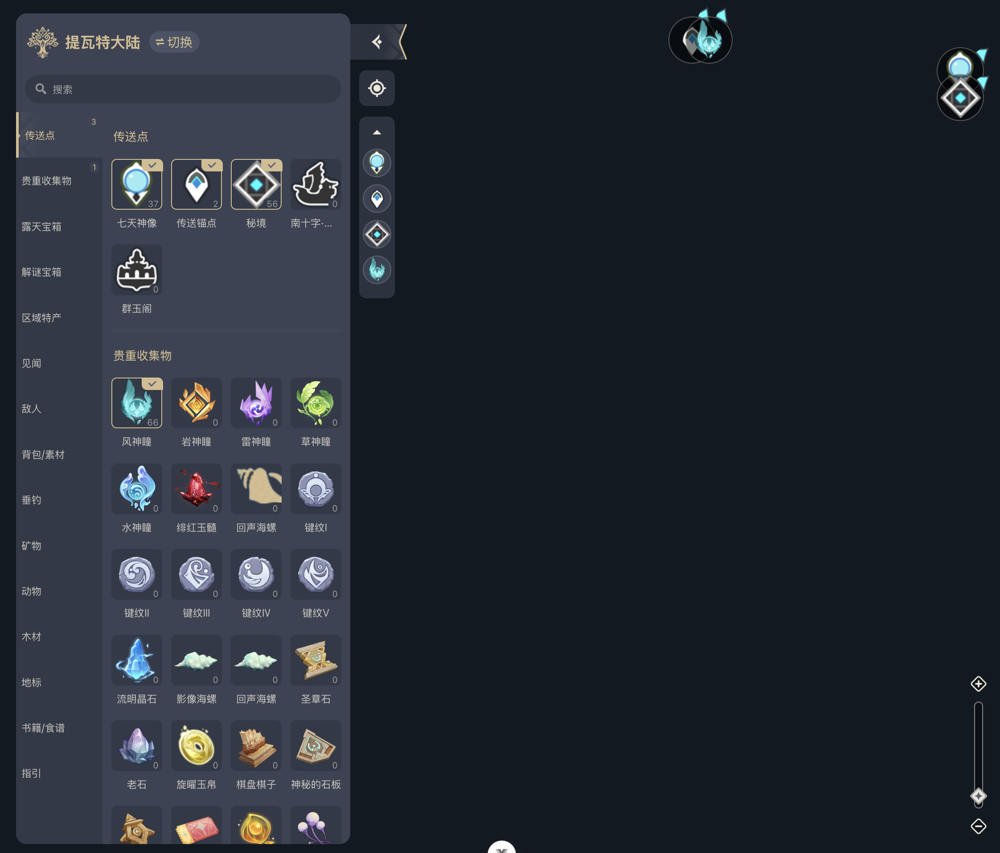

# Leaflet-Genshin-Map

## Tech Stack


## Description
《原神》大地图H5项目基于Vue 3、TypeScript以及Leaflet地图渲染库构建，旨在重现游戏内的丰富地理信息和交互体验。该项目不仅探索了如何将游戏元素如资源标记、地图缩放及筛选交互功能高效地迁移到Web平台上，同时也深入探讨了在实现过程中遇到的技术挑战，比如动态地图加载时的性能优化、UI与地图层之间的无缝通信以及复杂JS逻辑与地图联动的处理。 
The Genshin Impact Large Map H5 project is built using Vue 3, TypeScript, and the Leaflet map rendering library, aiming to recreate the game's rich geographic information and interactive experience. This project explores how to efficiently migrate game elements such as resource markers, map zooming, and filtering interactions to the web platform. It also delves into the technical challenges encountered during implementation, including performance optimization during dynamic map loading, seamless communication between the UI and map layers, and the integration of complex JavaScript logic with map interactions.




## Project Setup

```sh
npm install
```

### Compile and Hot-Reload for Development

```sh
npm run dev
```
Open [http://localhost:5173/](http://localhost:5173/) with your browser to see the result.

### Type-Check, Compile and Minify for Production

```sh
npm run build
```

### Lint with [ESLint](https://eslint.org/)

```sh
npm run lint
```
